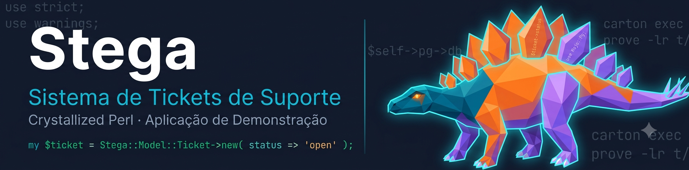

# Prompt para geração do banner da Stega

Gere este banner via **Google Imagen 2** (ou equivalente).
Salve o resultado como `assets/images/banner.png` no repositório.

---

## Conceito do mascote: Crystal Stega

**Crystal Stega** é um Estegossauro renderizado no mesmo estilo low-poly/cristalino do
Crystal Raptor (mascote do Crystallized Perl). A identidade visual é idêntica — mesma
paleta, mesma estética de facetas geométricas, mesmo fundo escuro — mas o animal é o
Estegossauro, cuja característica mais marcante (as placas dorsais em fileiras organizadas)
é a metáfora visual perfeita para uma fila de tickets de suporte: cada placa é um ticket,
cada fileira é uma fila, a estrutura toda é o sistema funcionando.

**Paleta (idêntica ao Crystal Raptor):**
- Azul teal profundo `#007399` → cabeça e pescoço
- Laranja vibrante `#F97316` → corpo e dorso
- Roxo-violeta `#8B5CF6` → cauda e pernas
- Ciano luminescente `#06B6D4` → bordas das facetas (glow neon)
- Fundo: Slate Deep navy `#0F172A`

---

## Prompt — Banner 1280×320 px

```text
Wide landscape banner 1280x320 px. Split composition: left two-thirds is text and
background, right one-third features the Crystal Stega mascot.

RIGHT SIDE — Crystal Stega mascot:
Full body right-profile view of a low-poly crystalline stegosaurus, facing left toward
the text. Alert standing posture — four legs planted, tail extended horizontally,
distinctive dorsal plates fully visible along the spine.

Body surface: Entire stegosaurus composed of precise triangular and polygonal geometric
facets, flat-shaded, clean sharp edges between polygons. No organic scales or skin —
only crystalline facets with a gemstone aesthetic.

Colors (head to tail gradient):
Deep teal-blue (#007399) on head, neck, and front shoulders →
vibrant orange (#F97316) on the main body torso and the dorsal plates →
violet-purple (#8B5CF6) on hind legs, lower belly, and tail.
Bright cyan (#06B6D4) luminescent neon glow along all facet edges throughout.

Dorsal plates: The stegosaurus's signature back plates are rendered as upright
crystalline facets — each plate is a single geometric polygon with its own flat-shaded
color from the gradient palette. The plates are arranged in two alternating rows,
each plate slightly different in color (shifting from orange to purple toward the tail).
Faint Perl code fragments etched on two of the largest plates in white monospaced font:
"$ticket->status" on one plate, "use Mojo::Pg;" on another.

Eye: Left eye visible, glowing amber-orange (#F59E0B), simplified geometric slit shape.
Feet: Four feet with crystalline claws, low-poly geometric toes.

Lighting: Internal luminescence from within the crystal facets — no external light
source. The mascot glows from within, especially the dorsal plate edges.

LEFT SIDE — Text area:
Solid deep slate navy (#0F172A) background (same as the overall background).

Title: "Stega" in Inter Bold, very large (approximately 80px equivalent), color #FFFFFF.
Subtitle line 1: "Sistema de Tickets de Suporte" in Inter Regular, medium size (28px
equivalent), color #06B6D4 (cyan accent).
Subtitle line 2: "Crystallized Perl · Aplicação de Demonstração" in Inter Regular,
small (18px equivalent), color #94A3B8 (muted slate).

Below the subtitle, a single line of code in JetBrains Mono Regular, 14px equivalent,
color #10B981 (syntax green):
my $ticket = Stega::Model::Ticket->new( status => 'open' );

All text is left-aligned with generous left padding.

OVERALL BACKGROUND:
Solid deep slate navy (#0F172A) across the full banner width.
Faint ghost Perl code text scattered at 8% opacity in the background for subtle texture:
"use strict;", "use warnings;", "$self->pg->db", "carton exec", "prove -lr t/".

COMPOSITION:
The Crystal Stega mascot occupies the right 35% of the banner, vertically centered,
with the body filling approximately 85% of the banner height. The mascot is slightly
cropped on the right edge — tail tip intentionally cut off — to create depth and suggest
the image extends beyond the frame.

A thin vertical divider line in #06B6D4 (cyan, 20% opacity) separates the text area
from the mascot area at approximately 65% from the left edge.

Technical: 1280x320 px landscape, flat dark background, crisp sharp facet edges,
high contrast figure on dark background. No outer border or frame.

Style: low-poly 3D concept art, crystalline gemstone illustration, sci-fi mascot
character design, clean geometric vector aesthetic rendered as raster. Consistent
aesthetic with a "Crystal Raptor" velociraptor mascot from the same project.

Negative: photorealistic dinosaur skin or scales, organic fur or feathers, watercolor,
ink sketch, blurry or soft edges, cartoon cute style, chibi proportions, decorative
borders or frames, watermark, any extra text labels overlaid on the image frame,
human figures, gradient background fill, any animal other than a stegosaurus.
```

---

## Proporções e uso

| Asset | Dimensão | Arquivo |
|-------|----------|---------|
| Banner do README | 1280×320 px | `assets/images/banner.png` |

O banner é referenciado no `README.md` como:

```markdown
<div align="center">
  <a href="https://github.com/Hibex-Solutions/crystallized-perl">
    
  </a>
</div>
```

Após gerar e salvar a imagem, o `README.banner.prompt.md` pode ser removido do
repositório ou mantido em `docs/` para referência futura.
