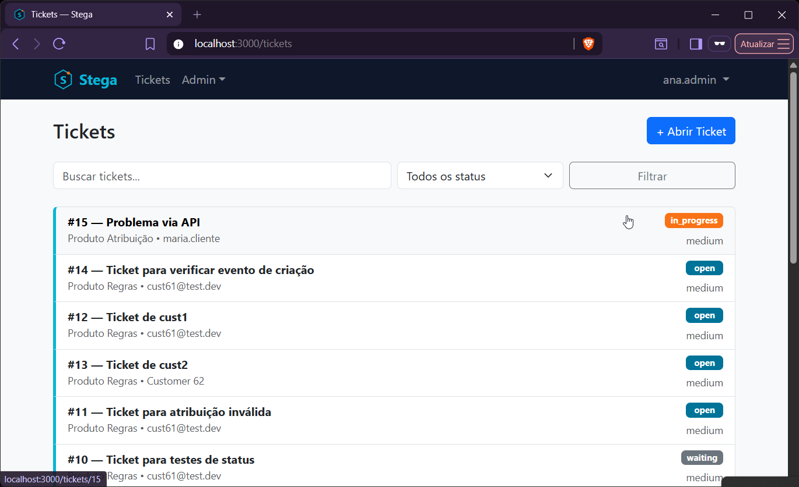
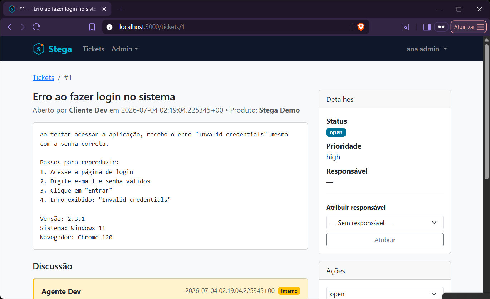
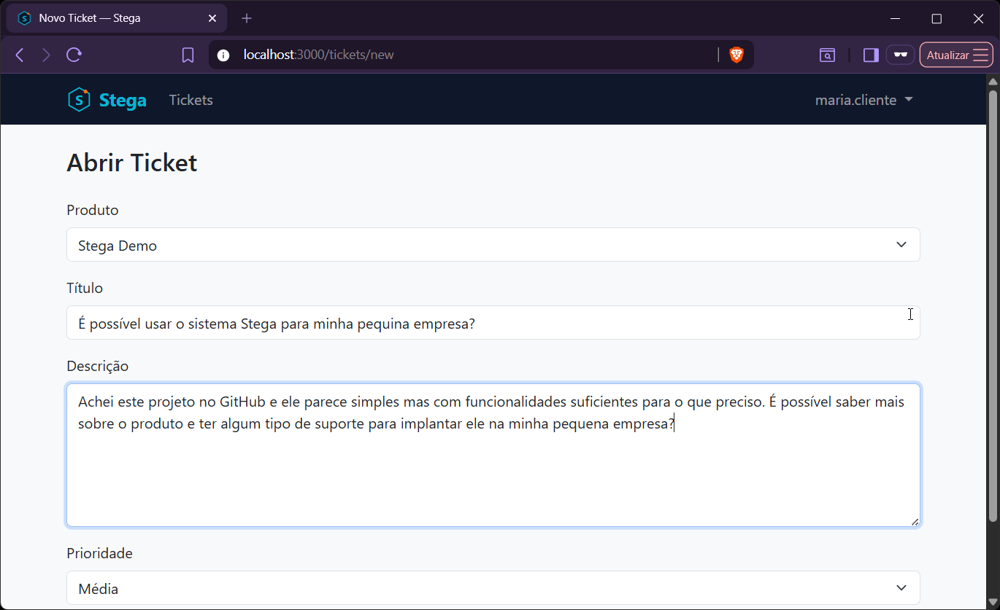
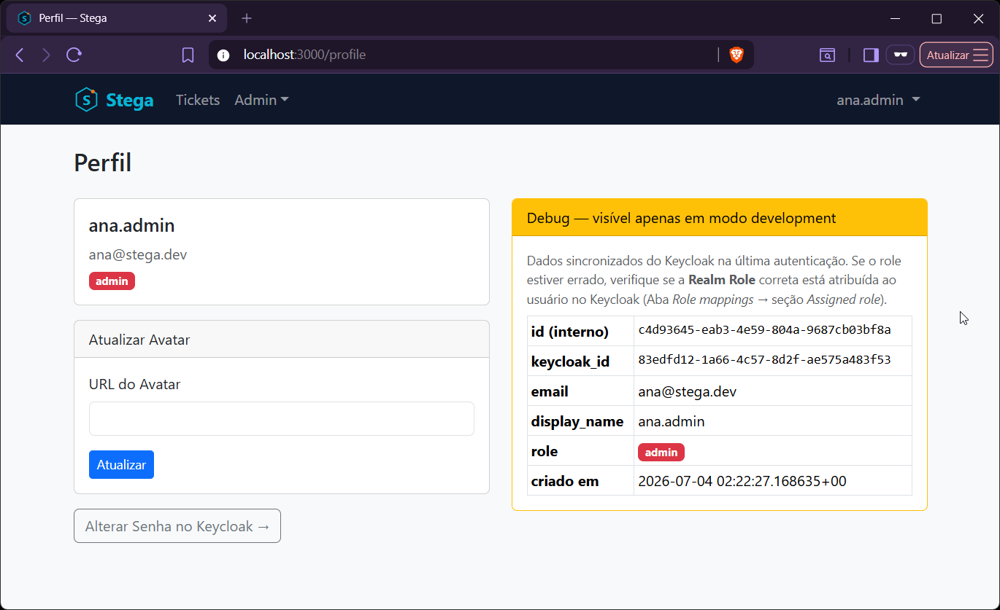

<div align="center">
  <a href="https://github.com/Hibex-Solutions/crystallized-perl">
    
  </a>
</div>

# Stega

Sistema de tickets de suporte — aplicação de demonstração do [Crystallized Perl](https://github.com/Hibex-Solutions/crystallized-perl).

[](https://github.com/Hibex-Solutions/crystallized-perl-stega/actions/workflows/ci.yml)
[](LICENSE)
[](https://github.com/Hibex-Solutions/crystallized-perl)

---

> Stega é um sistema multi-produto de tickets de suporte — um Zendesk simplificado para
> empresas de software. Construído com o stack [Crystallized Perl](https://github.com/Hibex-Solutions/crystallized-perl)
> como aplicação de referência canônica para todos os guias e exemplos de código do stack.

---

## Screenshots

Não é uma aplicação de brinquedo — é o que você tem em mãos depois de seguir a
trilha completa de guias do Crystallized Perl.

<table>
  <tr>
    <td width="50%">
      
      <p align="center"><sub>Lista de tickets — busca full-text, filtro por status, visão do admin</sub></p>
    </td>
    <td width="50%">
      
      <p align="center"><sub>Detalhe do ticket — discussão, atribuição de responsável, ações por papel</sub></p>
    </td>
  </tr>
  <tr>
    <td width="50%">
      
      <p align="center"><sub>Abertura de ticket — visão do cliente (<code>customer</code>)</sub></p>
    </td>
    <td width="50%">
      
      <p align="center"><sub>Perfil — dados sincronizados do Keycloak no primeiro login (OIDC)</sub></p>
    </td>
  </tr>
</table>

---

## O que é a Stega

**Stega** deriva de *Stegosaurus* (grego *stégē* = cobertura, abrigo, proteção). Um sistema
de suporte **protege** os usuários de problemas com o produto, **cobre** lacunas de
conhecimento e **abriga** o histórico completo de cada interação. As placas dorsais do
Estegossauro — organizadas em fileiras, cada uma com uma função — são a metáfora visual
da fila de tickets.

A Stega não é um tutorial simplificado. É uma aplicação real que exercita **todos** os
componentes do stack Crystallized Perl com casos de uso autênticos:

| Componente do stack | Como é exercitado na Stega | ADR |
|--------------------|---------------------------|-----|
| Mojolicious + Hypnotoad | Framework web principal; interface HTML + API REST no mesmo processo | [ADR-004](https://github.com/Hibex-Solutions/crystallized-perl/blob/main/docs/adrs/ADR-004-framework-web-mojolicious.md) |
| Carton + cpanm | Todas as dependências declaradas e fixadas em `cpanfile` | [ADR-005](https://github.com/Hibex-Solutions/crystallized-perl/blob/main/docs/adrs/ADR-005-gerenciamento-de-dependencias.md) |
| Moo + Moo::Role | Modelos de domínio (`Ticket`, `Comment`, `Product`, `User`) | [ADR-006](https://github.com/Hibex-Solutions/crystallized-perl/blob/main/docs/adrs/ADR-006-sistema-de-oo-moo.md) |
| PostgreSQL 16 | 7 migrations; busca full-text com `tsvector` + índice GIN | [ADR-007](https://github.com/Hibex-Solutions/crystallized-perl/blob/main/docs/adrs/ADR-007-banco-de-dados-relacional-postgresql.md) |
| Mojo::Pg + migrations | Toda a persistência relacional; acesso tipo-seguro ao banco | [ADR-016](https://github.com/Hibex-Solutions/crystallized-perl/blob/main/docs/adrs/ADR-016-acesso-a-dados-relacional-mojo-pg.md) |
| PostgreSQL JSONB | `custom_fields`, `metadata`, `payload`, `settings` — 4 usos distintos | [ADR-017](https://github.com/Hibex-Solutions/crystallized-perl/blob/main/docs/adrs/ADR-017-acesso-a-dados-documentos-jsonb.md) |
| PgQue (PostgreSQL) | Fila `stega.notifications`; worker de notificações como processo separado | [ADR-022](https://github.com/Hibex-Solutions/crystallized-perl/blob/main/docs/adrs/ADR-022-filas-em-postgresql.md) |
| Minion (job queue) | 4 jobs: boas-vindas, SLA, processamento de webhooks, relatórios; instância própria `db-jobs` | [ADR-008](https://github.com/Hibex-Solutions/crystallized-perl/blob/main/docs/adrs/ADR-008-message-broker-rabbitmq.md) (nota), [ADR-023](https://github.com/Hibex-Solutions/crystallized-perl/blob/main/docs/adrs/ADR-023-topologia-de-instancias-postgresql.md) |
| Topologia PostgreSQL | 4 instâncias dedicadas por finalidade (`db-app`/`db-jobs`/`db-events`/Keycloak) | [ADR-023](https://github.com/Hibex-Solutions/crystallized-perl/blob/main/docs/adrs/ADR-023-topologia-de-instancias-postgresql.md) |
| Keycloak + Crypt::JWT | Login OIDC (web); JWT Bearer (API); 3 papéis: customer, agent, admin | [ADR-009](https://github.com/Hibex-Solutions/crystallized-perl/blob/main/docs/adrs/ADR-009-autenticacao-keycloak-jwt.md) |
| OpenAPI v3 | Contrato completo da API em `api/stega.yaml` | [ADR-015](https://github.com/Hibex-Solutions/crystallized-perl/blob/main/docs/adrs/ADR-015-contrato-de-api-openapi-v3.md) |
| Docker multi-stage | Imagem de produção com build em dois estágios | [ADR-010](https://github.com/Hibex-Solutions/crystallized-perl/blob/main/docs/adrs/ADR-010-orquestracao-kubernetes.md) |
| Kubernetes | 3 Deployments em produção + InitContainer para migration | [ADR-010](https://github.com/Hibex-Solutions/crystallized-perl/blob/main/docs/adrs/ADR-010-orquestracao-kubernetes.md) |
| Test::Mojo + prove | Suite cobrindo todas as rotas da API e fluxos de autenticação | [ADR-011](https://github.com/Hibex-Solutions/crystallized-perl/blob/main/docs/adrs/ADR-011-estrategia-de-testes.md) |

## Papéis de usuário

| Papel | Descrição | Gerenciado por |
|-------|-----------|----------------|
| `customer` | Abre e acompanha tickets dos próprios produtos | Keycloak |
| `agent` | Atende tickets, adiciona comentários internos, muda status | Keycloak |
| `admin` | Gerencia produtos, usuários e regras de SLA | Keycloak |

## Pré-requisitos

- **Perl 5.42+** (via [perlbrew](https://perlbrew.pl/) no Linux/macOS ou [berrybrew](https://github.com/stevieb9/berrybrew) no Windows)
- **Carton** (`cpanm --notest Carton`)
- **Docker** e **Docker Compose**

Consulte [DEVELOPMENT.md](DEVELOPMENT.md) para o guia completo de instalação passo a passo.

## Executando localmente

> **Windows/PowerShell**: `carton exec perl ...`/`carton exec prove ...` sem
> `| Out-Host` imprime atrasado e dessincronizado do prompt (Windows não tem
> `exec()` real). Os blocos abaixo já trazem o comando equivalente comentado
> logo após cada linha afetada — descomente e use no lugar do original. Rode
> também, uma vez por sessão de terminal, antes do primeiro comando:
>
> ```powershell
> [Console]::OutputEncoding = [System.Text.Encoding]::UTF8; chcp 65001 | Out-Null
> ```
>
> Sem isso, `| Out-Host` corrige a sincronia mas introduz acentos corrompidos
> (`Vers├úo` em vez de `Versão`). Detalhes completos em
> [DEVELOPMENT.md](DEVELOPMENT.md#1-visão-geral-do-ambiente).
>
> **O worker do Minion não roda em Windows nativo** (`Minion workers do not
> support fork emulation` — restrição do próprio Minion, não do PgQue). Use
> Docker Compose para esse processo especificamente; os demais rodam
> nativamente sem exceção. Detalhes em
> [DEVELOPMENT.md](DEVELOPMENT.md#1-visão-geral-do-ambiente) — resolver isso de
> vez é pendência de pesquisa aberta (ADR-024, `Proposta`) no repositório
> central.

```bash
# 1. Instalar dependências Perl
carton install

# 2. Copiar variáveis de ambiente
cp .env.example .env

# 3. Iniciar os serviços de apoio (4 instâncias PostgreSQL + Keycloak)
docker compose up -d postgres-app postgres-jobs postgres-events postgres-keycloak keycloak

# 4. Aplicar as migrations do banco de dados e instalar o PgQue
carton exec perl eng/migrate.pl
# Windows/PowerShell: carton exec perl eng/migrate.pl | Out-Host
carton exec perl eng/bootstrap_pgque.pl
# Windows/PowerShell: carton exec perl eng/bootstrap_pgque.pl | Out-Host

# 5. Popular o banco com dados de desenvolvimento
carton exec perl eng/seed.pl
# Windows/PowerShell: carton exec perl eng/seed.pl | Out-Host

# 6. Iniciar a aplicação em modo de desenvolvimento
carton exec perl script/stega daemon
# Windows/PowerShell: carton exec perl script/stega daemon | Out-Host
```

A aplicação estará disponível em `http://localhost:3000`.

## Rodando os testes

```bash
carton exec prove -lr t/
# Windows/PowerShell: carton exec prove -lr t/ | Out-Host
```

Para gerar relatório de cobertura de código:

```bash
HARNESS_PERL_SWITCHES='-MDevel::Cover=-ignore,local/' carton exec prove -lr t/
# Windows/PowerShell: $env:HARNESS_PERL_SWITCHES = '-MDevel::Cover=-ignore,local/'; carton exec prove -lr t/ | Out-Host
carton exec cover -report html
# Windows/PowerShell: carton exec cover -report html | Out-Host
open cover_db/coverage.html
# Windows/PowerShell: start cover_db/coverage.html
```

## Gerando a imagem Docker

```bash
docker build -t stega:dev .
```

## Quatro processos em produção

```
stega-api                  — Hypnotoad (pré-fork): serve a interface web e a API REST
stega-minion-worker        — Minion worker: processa jobs internos (SLA, relatórios, webhooks) — não roda em Windows nativo (ADR-024, pendência), ver DEVELOPMENT.md
stega-notification-worker  — consumidor PgQue: despacha e-mail, Slack e webhooks de saída
stega-pgque-ticker         — tick de rotação do PgQue (réplica única, obrigatória)
```

Todos os quatro são declarados no `compose.yml` para execução local completa.

## Estrutura do projeto

```
crystallized-perl-stega/
├── api/stega.yaml          ← contrato OpenAPI v3 completo
├── migrations/             ← migrations (migrations/N/{up,down}.sql via Mojo::Pg::Migrations->from_dir)
├── lib/
│   ├── Stega.pm            ← aplicação principal (herda Mojolicious)
│   └── Stega/
│       ├── Controller/     ← controllers (Auth, Dashboard, Ticket, Comment...)
│       ├── Model/          ← modelos Moo (Ticket, Comment, Product, User)
│       ├── Domain/         ← Policy (autorização) + Domain (regra + execução, ADR-020) — testáveis sem banco
│       ├── Repository/     ← contrato (Moo::Role) + implementação Pg — ADR-020
│       ├── Job/            ← 4 jobs Minion
│       ├── Notification.pm ← publish() de eventos via PgQue (ADR-022)
│       └── Worker/         ← NotificationWorker (pgque.receive/ack/nack)
├── templates/              ← templates Mojolicious (interface server-rendered)
├── t/                      ← suite de testes (Test::Mojo + prove)
├── eng/                    ← ferramentas de apoio ao dev/implantação (ADR-013)
├── script/                 ← processos de execução da app: stega, worker, pgque_ticker
├── vendor/pgque/           ← PgQue vendorizado (SQL puro, Apache-2.0 — ADR-022)
└── compose.yml             ← 4 instâncias PostgreSQL + Keycloak 26 (ADR-023)
```

## Documentação

Este repositório implementa as decisões documentadas no stack
[Crystallized Perl](https://github.com/Hibex-Solutions/crystallized-perl),
em especial a
[ADR-018](https://github.com/Hibex-Solutions/crystallized-perl/blob/main/docs/adrs/ADR-018-aplicacao-de-demonstracao.md),
que define o escopo e o domínio da Stega, e todas as ADRs de tecnologia referenciadas
na tabela de componentes acima.

## Contribuindo

Para reportar erros, propor melhorias ou contribuir com código, consulte
[CONTRIBUTING.md](https://github.com/Hibex-Solutions/crystallized-perl/blob/main/CONTRIBUTING.md)
no repositório principal do Crystallized Perl.

## Licença

MIT — veja [LICENSE](LICENSE).

Copyright © 2026 Hibex Solutions
